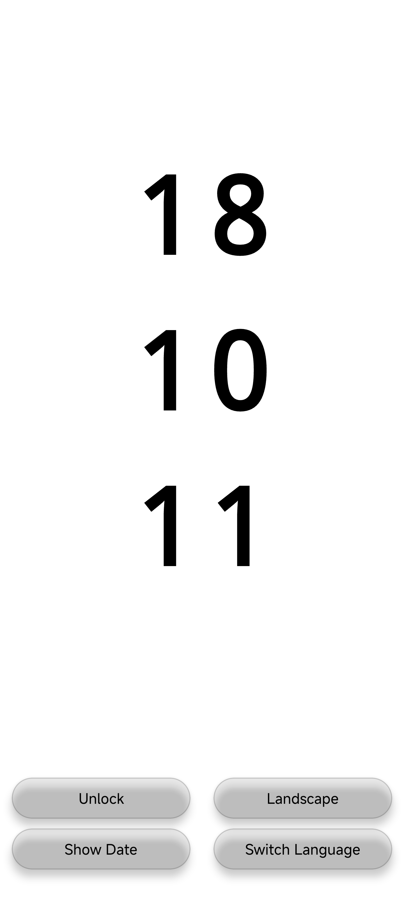

# Clock - 全屏时钟应用

[English](README_EN.md) | [中文](README.md)

一个使用 React Native 开发的全屏实时时钟 Android 应用。

## 功能特点

- ⏰ **实时时间显示** - 每秒自动更新时间
- 📅 **日期显示** - 显示当前日期和星期
- 🌓 **主题切换** - 支持深色/浅色主题，点击屏幕即可切换
- 📱 **全屏沉浸式** - 隐藏状态栏和导航栏，全屏显示
- 💡 **屏幕常亮** - 自动保持屏幕常亮
- 🎨 **简洁设计** - 大字体，居中布局，美观易读

## 应用截图

### 竖屏模式


### 横屏模式


## 技术栈

- React Native 0.72.6
- TypeScript
- Android SDK

## 环境要求

- Node.js >= 16
- React Native CLI
- Android Studio（用于 Android SDK 和模拟器）或物理 Android 设备
- JDK 17+

## 安装和运行

### 1. 安装依赖

```bash
npm install
```

或使用 yarn：

```bash
yarn install
```

### 2. 运行应用

#### 在 Android 设备/模拟器上运行：

```bash
npm run android
```

或

```bash
yarn android
```

#### 启动 Metro 打包器：

在另一个终端运行：

```bash
npm start
```

或

```bash
yarn start
```

## 使用说明

1. **查看时间** - 应用启动后会全屏显示当前时间
2. **切换主题** - 点击屏幕任意位置可在深色和浅色主题之间切换
3. **查看日期** - 时间下方会显示当前日期和星期

## 项目结构

```
Clock/
├── App.tsx                 # 主应用组件
├── index.js               # 应用入口
├── package.json           # 项目依赖配置
├── android/               # Android 原生代码和配置
│   ├── app/
│   │   ├── src/main/
│   │   │   ├── java/com/clock/
│   │   │   │   ├── MainActivity.java    # Android Activity（全屏配置）
│   │   │   │   └── MainApplication.java # Application 类
│   │   │   ├── res/
│   │   │   │   └── values/
│   │   │   │       ├── styles.xml       # 全屏主题配置
│   │   │   │       └── strings.xml      # 字符串资源
│   │   │   └── AndroidManifest.xml      # Android 清单文件
│   │   └── build.gradle
│   └── build.gradle
└── README.md
```

## 开发说明

### 修改时间格式

编辑 `App.tsx` 中的 `formatTime` 函数来修改时间显示格式。

### 修改字体大小

编辑 `App.tsx` 中的 `styles` 对象来调整字体大小。

### 自定义主题颜色

在 `App.tsx` 中修改 `backgroundColor` 和 `textColor` 变量来设置自定义颜色。

## 构建发布版本

### 生成 APK

清理并构建 Release 版本：

**Windows:**
```bash
cd android
gradlew clean
gradlew assembleRelease
```

**Mac/Linux:**
```bash
cd android
./gradlew clean
./gradlew assembleRelease
```

生成的 APK 文件在：`android/app/build/outputs/apk/release/app-release.apk`

### 安装 Release 版本

构建完成后，可以使用以下命令安装到连接的设备：

```bash
cd ..
adb install -r android/app/build/outputs/apk/release/app-release.apk
```

`-r` 参数表示如果应用已安装则替换安装。

### 生成签名 APK

1. 生成密钥库（如果还没有）：
```bash
keytool -genkeypair -v -storetype PKCS12 -keystore my-release-key.keystore -alias my-key-alias -keyalg RSA -keysize 2048 -validity 10000
```

2. 配置签名：编辑 `android/app/build.gradle`，添加签名配置

3. 构建签名 APK：

**Windows:**
```bash
cd android
gradlew clean
gradlew assembleRelease
```

**Mac/Linux:**
```bash
cd android
./gradlew clean
./gradlew assembleRelease
```

## 故障排除

### 快速环境检查

Windows 用户可以使用提供的脚本快速检查环境：

```cmd
check-env.bat
```

这会检查所有必要的组件是否正确配置。

### 如果遇到 "adb 不是内部或外部命令" 错误

**使用快速配置脚本（推荐）：**
```cmd
setup-env.bat
```

**或手动配置环境变量：**
1. 找到 Android SDK 路径（通常在 `C:\Users\<用户名>\AppData\Local\Android\Sdk`）
2. 设置系统环境变量 `ANDROID_HOME` 为 SDK 路径
3. 在 PATH 中添加：
   - `%ANDROID_HOME%\platform-tools`
   - `%ANDROID_HOME%\tools`
   - `%ANDROID_HOME%\tools\bin`
4. 重启命令提示符

详细说明请查看 `FIX-ENV.md`

### 如果遇到 Java 版本错误（Java 8 不兼容）

**错误信息示例：**
```
Incompatible because this component declares a component, compatible with Java 11 
and the consumer needed a component, compatible with Java 8
```

**原因：** Gradle 7.4.2 需要 Java 11+，但您使用的是 Java 8

**解决方案：**
1. 运行 `check-java-version.bat` 检查当前 Java 版本
2. 升级到 Java 17（推荐）：
   - 下载：https://adoptium.net/temurin/releases/?version=17
   - 设置 `JAVA_HOME` 环境变量指向新安装的 JDK 17
   - 在 PATH 中添加 `%JAVA_HOME%\bin`
   - 重启命令提示符

详细说明请查看：
- `FIX-JAVA-ERROR.md` - 快速修复指南
- `UPGRADE-JAVA.md` - 详细升级步骤

### 如果遇到 "SDK location not found" 错误

设置 `ANDROID_HOME` 环境变量：
- Windows: `set ANDROID_HOME=C:\Users\YourUsername\AppData\Local\Android\Sdk`
- Mac/Linux: `export ANDROID_HOME=$HOME/Library/Android/sdk`

### 如果找不到连接的设备

1. **检查 USB 调试：** 确保手机已启用 USB 调试
2. **授权电脑：** 连接手机时，在手机上点击"允许 USB 调试"，并勾选"一律允许"
3. **验证连接：** 运行 `adb devices` 查看设备列表
4. **重启 adb：** 如果设备未显示，运行 `adb kill-server && adb start-server`

### 如果 Metro 打包器无法启动

清理缓存：
```bash
npm start -- --reset-cache
```

### 如果应用无法安装到设备

确保：
1. 已启用开发者选项和 USB 调试
2. 设备已通过 USB 连接或模拟器正在运行
3. 运行 `adb devices` 确认设备已连接
4. 手机已授权此电脑进行 USB 调试

## 许可证

MIT License

## 贡献

欢迎提交 Issue 和 Pull Request！

